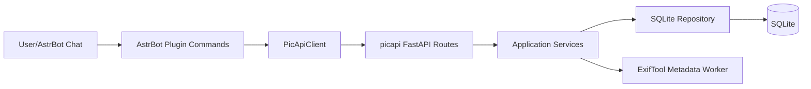

# astrbot_plugin_pic_rater

`astrbot_plugin_pic_rater` 是一个 **AstrBot 插件项目**：  
- 前端交互层是 AstrBot 指令插件（本仓库根目录）。  
- 图片服务层是 **独立服务 `picapi`**（建议 Docker 部署，代码已从本仓库剥离）。  

整体目标：随机发图、标签检索、评分统计、XMP 元数据回写。

## 快速启动

1. 使用 Docker 启动独立 `picapi` 服务（本仓库不再包含服务端代码）。  
2. 将本项目作为插件放入 AstrBot：`data/plugins/astrbot_plugin_pic_rater`。  
3. 在 AstrBot 面板配置 `picapi_url`（默认 `http://picapi:8000`）。  
4. 在 AstrBot 面板启用/重载插件。  

---

## 插件配置（WebUI）

本插件在根目录提供 `_conf_schema.json`，AstrBot 会自动在管理面板生成可视化配置，并写入
`data/config/astrbot_plugin_pic_rater_config.json`。

当前关键配置项：
- `picapi_url`：picapi API 基址（默认 `http://picapi:8000`）
- `http_timeout`：`connect/read/write/pool` 超时
- `message.show_image_meta`：发图后是否展示元信息
- `message.show_usage_on_invalid_score`：评分输入错误时是否提示用法
- `sync_progress.first_hint_after_sec`：整理图库首次进度提示时间
- `sync_progress.ping_every_sec`：整理图库进度提示间隔
- `sync_progress.show_progress_bar`：是否显示同步进度条
- `command_aliases.cleanup_keywords`：触发“清理模式”的关键词列表

---

## 功能说明

### 1) 随机发图
- 指令：`#来一张 [关键词|分类表达式]`
- 支持两种筛选：
  - 关键词检索（`q`）：例如 `#来一张 1girl`
  - 分类表达式（`cat`）：例如 `#来一张 风景:3,人像:1` 或 `#来一张 壁纸/风景`
- 择图策略支持少评分优先/加权随机，降低重复命中。

### 2) 图片评分
- 指令：`#评分 <0~5> [备注]`
- 针对“当前会话上次发送的图片”打分。
- 插件会优先用 `relpath`，失败时回退 `id` 调用后端评分接口。
- 达到阈值后会将评分结果回写到 XMP（依赖 `exiftool`）。

### 3) 类目浏览
- 指令：`#图类目 [path]`
- 不带参数列出顶级目录；带参数可逐级下钻子目录并查看数量。

### 4) 图库整理
- 指令：`#整理图库 [清理]`
- 串联执行：
  - 扫盘入库（`/reindex`）
  - 同步 XMP 标签（`/sync_subjects`）
  - 可配合 FTS 重建流程用于检索加速

---

## 接口说明（picapi）

### 核心业务接口
- `GET /random_pic`：随机取图（支持 `q`/`cat`/`bias`/`alpha`）
- `POST /rate`：写入评分与备注，更新均分/次数，按阈值回写 XMP
- `GET /categories`：获取顶级分类
- `GET /dirs`：获取指定目录下的子目录统计
- `POST /reindex`：重建/补齐图库索引，可选清理失效记录
- `POST /sync_subjects`：同步 XMP:Subject 到标签表
- `GET /search`：检索（FTS 优先，失败时降级 LIKE）

### 运维接口
- `GET /health`：健康检查（图库、配置、基础状态）
- `GET /admin/sync_progress`：同步任务进度
- `POST /admin/rebuild_fts`：重建 FTS
- `POST /admin/refresh_fts_tags`：刷新 FTS 标签映射

### 错误返回规范
- 统一结构：`{"code": "...", "message": "...", "detail": ...}`

---

## 架构说明

- **部署形态**
  - `picapi`：Docker 容器部署（推荐通过 compose）
  - 插件：作为 AstrBot 插件加载运行
- **调用链路**
  - 聊天指令 -> 插件命令层 -> HTTP 调用 `picapi` -> 服务层执行业务 -> DB/ExifTool

## 故障定位

- 搜索无结果：先执行 `#整理图库` 触发重建索引与标签同步。
- 评分 404：重新 `#来一张`，插件会保存新 `id/relpath`。
- XMP 未回写：检查 `WRITE_META_MIN_COUNT` 与 `exiftool` 可执行性。

---

## 模块划分

### 插件模块（AstrBot）
- `main.py`：插件入口（薄封装）
- `__init__.py`：插件包标识（可为空）
- `_conf_schema.json`：插件配置 Schema（WebUI 可视化）
- `requirements.txt`：插件依赖（仅 HTTP 调用所需）
- `metadata.yaml`：插件元信息
- `README.md`：插件使用说明

### 独立服务（picapi）

`picapi` 为独立部署服务，已从本仓库剥离为单独项目/仓库（Docker 运行）。插件仅通过 HTTP 调用它的接口。

---

## 常用命令速查

- `#来一张 [关键词|分类表达式]`
- `#评分 <0~5> [备注]`
- `#图类目 [path]`
- `#整理图库 [清理]`
